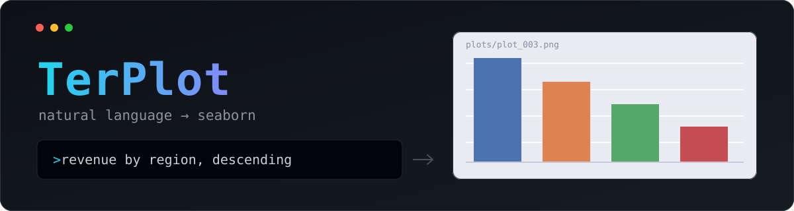
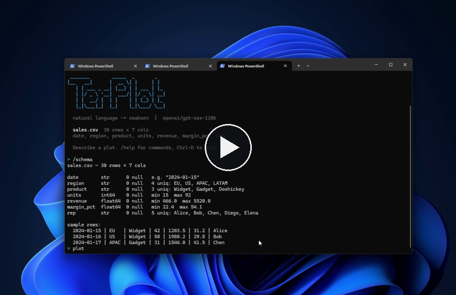
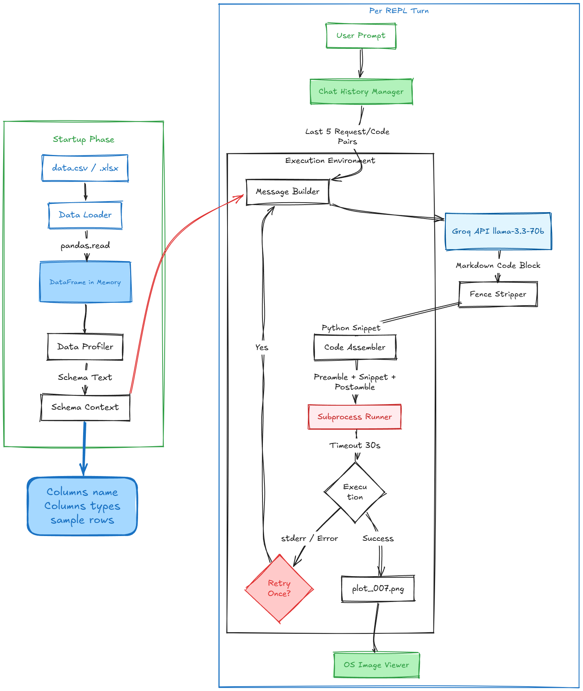

Describe a plot in plain English and get a PNG, from the terminal. TerPlot profiles your
CSV or Excel file, sends that schema to an LLM on Groq, and runs the seaborn code it writes
back in a sandboxed subprocess.

**Demo:** click to play the full run — three plot requests, each PNG saved to `plots/` and
opened in the default image viewer.

[](demo.mp4)

<!-- For inline playback on github.com: drag demo.mp4 into any issue comment, copy
     the https://github.com/user-attachments/assets/... URL GitHub gives back, and
     paste it on a line of its own above. Repo-relative <video> tags are stripped
     from rendered READMEs, so the poster-link above is the portable version. -->

## Setup

```bash
pip install -r requirements.txt
cp .env.example .env      # then put your key in it
```

`.env` is gitignored. A free key comes from https://console.groq.com/keys.
A real environment variable overrides the file, so `GROQ_API_KEY=... python -m terplot ...`
works too.

## Run

```bash
python -m terplot sample/sales.csv
```

| Flag | Effect |
|---|---|
| `--outdir DIR` | where PNGs go (default `plots/`) |
| `--no-open` | don't launch the image viewer |
| `--show-code` | print the generated code every turn |

In-REPL: `/schema` shows what the model knows about your data, `/code` shows the
code behind the last plot, `/help` lists commands.

`TERPLOT_MODEL` overrides the model (default `openai/gpt-oss-120b`).

## How it works



Your columns, dtypes, null counts and 3 sample rows go to the model as context. It
writes *only* the plotting lines — TerPlot wraps them in a fixed preamble that imports
seaborn and loads your data, and a postamble that saves the PNG. That runs in a
subprocess with a 30s timeout, so a bad plot can't take the REPL down with it. If the
code errors, the stderr goes back to the model and it gets one retry.

## Note

TerPlot executes model-generated Python on your machine. The subprocess and timeout
protect against accidents, not against malice — don't point it at data files or
prompts you don't trust.

## Tests

```bash
python -m pytest tests/ -q
```
